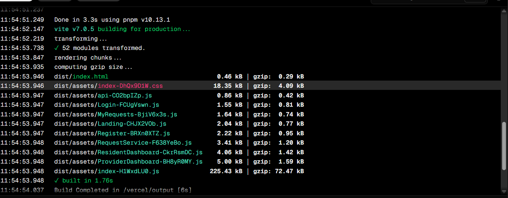

# Neighborhood Service Directory - MERN Stack Application

This is a MERN stack project for the **Neighborhood Service Directory**, developed as part of the DevOps & Deployment Week-7 Assignment. The platform allows local residents to connect with nearby service providers (e.g., plumbers, electricians) by browsing, filtering, and making service requests. Service providers can register, manage their services, and respond to requests.

## 🌐 Live URLs

- **Frontend (Vercel)**: [https://neighborhood-directory.vercel.app](https://neighborhood-serv-git-20b7c1-arafatbashir093-gmailcoms-projects.vercel.app)  
- **Backend API (Render)**: [https://neighborhood-api.onrender.com](https://neighborhood-service-directory.onrender.com/)

---

## 📦 Technologies Used

- **Frontend**: React.js, Axios, TailwindCSS
- **Backend**: Node.js, Express.js, MongoDB, JWT Authentication
- **Database**: MongoDB Atlas
- **Deployment**: Vercel (Frontend), Render (Backend)
- **CI/CD**: GitHub Actions
- **Monitoring**: Render built-in monitoring, Vercel analytics, health check endpoints

---

## 🚀 Features

- User & Provider Authentication (JWT)
- Search & Filter Service Providers
- Request Management Dashboard
- Provider Profile Management
- Responsive UI with Tailwind
- RESTful API with Role-based Access Control
- Environment Config for Production
- CI/CD integration with GitHub Actions
- Deployment via Vercel and Render

---

## 🧪 CI/CD Pipeline

CI/CD is configured using **GitHub Actions**. On every push to the main branch:

- Linting and build steps are triggered
- Tests (if added) are run
- On success, deployment is triggered for both frontend and backend

### ✅ CI/CD Screenshots

> Add screenshots of your GitHub Actions workflow or Vercel/Render build logs below:




---

## 🔧 Project Structure

```

client/
├── public/
├── src/
│   ├── components/
│   ├── pages/
│   ├── api/
│   └── contexts/
server/
├── controllers/
├── models/
├── routes/
├── middleware/
├── config/
.github/
└── workflows/
└── ci.yml

````

---

## 🔐 Environment Variables

You must create a `.env` file for both frontend and backend. Use the `.env.example` provided.

### Example Backend `.env`

```env
PORT=5000
MONGO_URI=your_mongodb_connection_string
JWT_SECRET=your_jwt_secret
````

### Example Frontend `.env`

```env
VITE_API_URL=https://neighborhood-api.onrender.com
```

---

## 🧰 Deployment Instructions

### Backend (Render)

1. Go to render.com
2. Create a new web service
3. Connect to your GitHub repo
4. Set environment variables
5. Set `start` command as: `npm start`
6. Automatic deploy from `main` branch

### Frontend (Vercel)

1. Go to vercel.com
2. Import project from GitHub
3. Set `VITE_API_URL` in environment variables
4. Build command: `npm run build`
5. Output directory: `dist`
6. Deploy

---

## 📊 Monitoring Setup

### ✅ Render

* Render provides **built-in logging and monitoring**
* Health check endpoint implemented at:
  `GET /api/health`

### ✅ Vercel

* Vercel provides analytics for request latency, uptime, and build status

### Future Improvements

* Add Sentry or LogRocket for frontend error tracking
* Add Prometheus or Datadog integration for backend metrics

---

## 🧵 Maintenance Plan

* Weekly dependency updates
* Monthly MongoDB backups via Atlas
* Monitor uptime via Render
* Add alerts for failed deployments
* Documentation maintained in README

---

## 📄 Submission Checklist

* ✅ Complete MERN stack application code
* ✅ CI/CD configuration in `.github/workflows/`
* ✅ `.env.example` files included
* ✅ Deployed backend (Render) and frontend (Vercel)
* ✅ Screenshots of CI/CD
* ✅ Monitoring and deployment documented
* ✅ Pushed regularly to GitHub

---

## 🧑‍💻 Developer

**Mohamed Bashir**

## 📝 License

MIT License – free to use, modify, and share.


```
